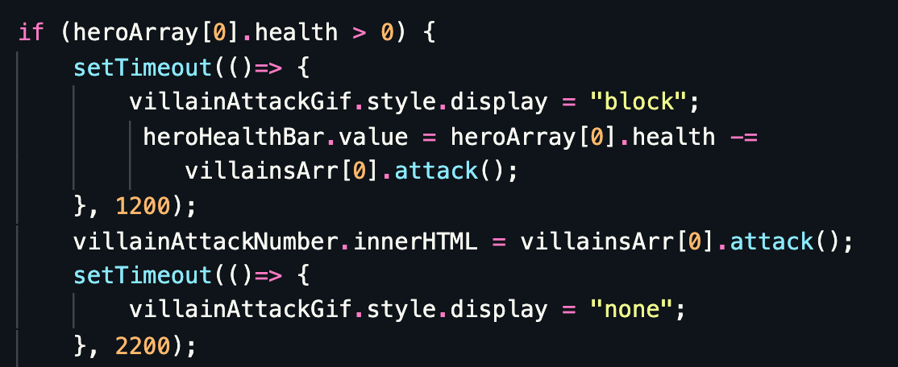
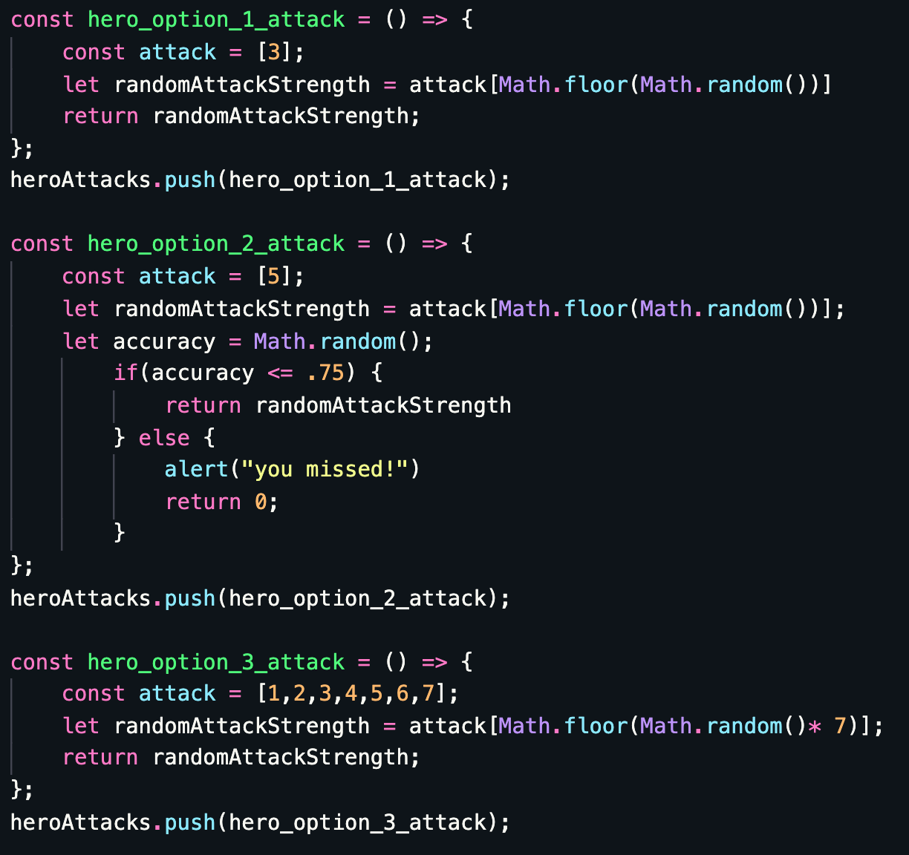

# Attack Of The Holidays

#### Game description:
This is a single player game that takes the user on a journey through the year 2099. In this epic quest, the player must fight magical creatures that are trying to take over the world. The player must defeat 3 villains over the course of 3 different rounds while using his special attacks to slay them. Each round increases with more and more difficulty. Through the use of JavaScript, HTML, CSS, and a lot of perseverance, this game has come to life. 

So what's next? We need your help...

The year is 2099 and these myths and legends have come out of hiding to take over the world and only person who can stop them is YOU. 

 
<h4>Technologies used:</h4>
* JavaScript - 48.7%
* HTML - 30.5%
* CSS - 20.8%
* Node
* Visual Studio Code

<h4>Frequently used:</h4>
* Objects & Classes
* Arrays
* JS Functions
* Animations
* Modals

<h4>Code snippets:</h4>

######
I'm proud of this code snippet because it integrated an image reavealing itself with an animation, updating a progress bar and delaying an enemy attack until the players attack and animation finished. 
##

######
This code is what I used to create the different attack strengths for the player attack buttons. I enjoyed using different techniques for each such as picking a raondom number from an array or giving the attack accuracy. 
###
<h4>What I would add:</h4>
 I would like to add more player options to chose from at the home screen. Each character would have different health and attack levels. I would also like to create options for difficulty levels. Adding an easy, medium, or hard which would increase the health and attack strength of the enemies. Finally I would like to design this game so you could vs other people online instead of just the computer.

<h4>What I would change:</h4>
Currently if you lose a round, you have to restart the game from the beginning. I would like to add a function that would allow you to restart from the beginning of each level if you lose.

### Thanks for checking out my game!
<h5>- Drew Wilson</h5>